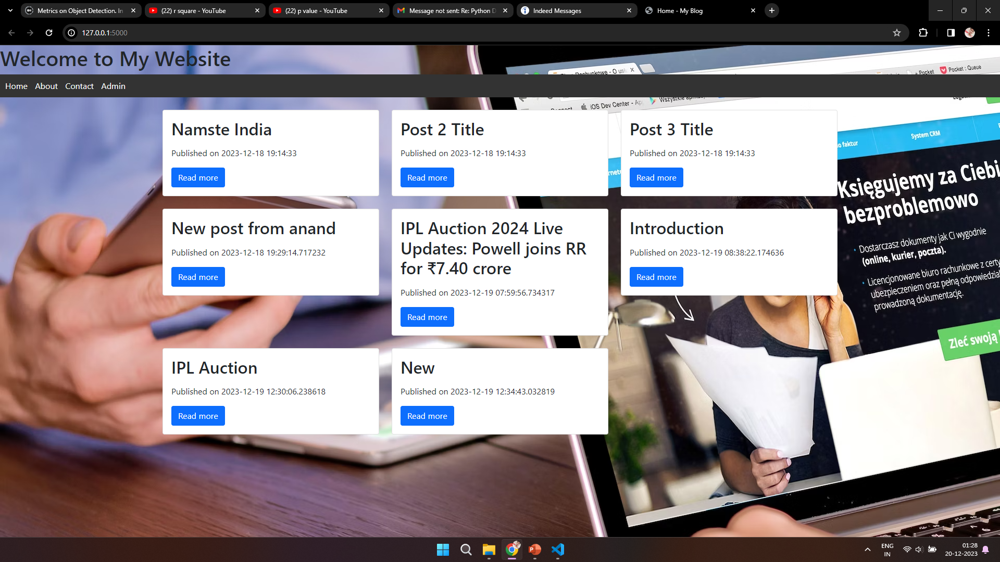

# Personal Blog Platform

This is a simple personal blog platform where you can share your thoughts and stories. Users can read posts, and you, as the admin, can add or delete posts.

## Table of Contents

- [Overview](#overview)
- [Features](#features)
- [Getting Started](#getting-started)
  - [Prerequisites](#prerequisites)
  - [Installation](#installation)
  - [Running the Application](#running-the-application)
- [Project Structure](#project-structure)

## Overview

Welcome to your Personal Blog Platform! This platform is designed for sharing personal stories and engaging with readers. As the admin, you have the ability to add new blog posts and delete existing ones. The platform features a responsive design to ensure an optimal viewing experience on various devices.

## Features

- **Read Blog Posts:** Users can read personal stories and thoughts shared on the blog.
- **Engage with Comments:** Readers can engage with the content by leaving comments on blog posts.
- **Admin CRUD Operations:** As the admin, you have the ability to perform CRUD (Create, Read, Update, Delete) operations on blog posts. These actions are protected by an admin password.

## Getting Started

### Prerequisites

Ensure you have the following installed on your machine:

- **Python:** 
- **Flask:** 
- **SQLite**

### Installation

1. **Clone the repository:**

   ```bash
   [git clone https://github.com/your-username/personal-blog-platform.git](https://github.com/DevilANANDGupta/zedblock_bloging.git)

2. Navigate to the project directory:

  cd personal-blog-platform
  
3.Create a virtual environment:

  python -m venv venv
4.Activate the virtual environment:

On Linux/macOS:
source venv/bin/activate
On Windows:
.\venv\Scripts\activate
5. Install dependencies
pip install -r requirements.txt


Running the Application
Run the Flask application: cmd/terminal: py run.py
Open your web browser and go to http://127.0.0.1:5000/.


app/: Contains the main Flask application.

init.py: Initializes the Flask application.
routes.py: Defines the application routes.
models.py: Defines the database models.
templates/: Contains HTML templates.
static/: Contains static files such as CSS.

venv/: Virtual environment folder.

.gitignore: Specifies files and directories to be ignored by Git.

README.md: Project documentation.

requirements.txt: List of project dependencies.


## Project Structure

The project structure is organized as follows:

```
zedblock_bloging/
│
├── app/Project
│   ├── __init__.py
│   ├── routes.py
│   ├── models.py
│   └── templates/
│       ├── base.html
│       ├── homepage.html
│       ├── post_detail.html
│       └── admin.html
│
├── static/
│   ├── css/
│   │   └── styles.css
│   
│       
│
├── venv/
├── .gitignore
├── README.md
├── requirements.txt
├── run.py
└── config.py

zedblock_bloging/For-sqlite
│
├── blog.db
├── blog.sql


run.py: Script to run the Flask application.

config.py: Configuration settings for the application.

